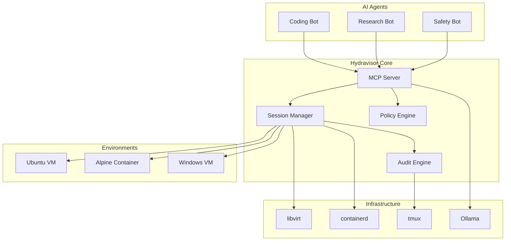

# Hydravisor

**Auditable AI Agent Sandbox Manager**

Hydravisor is a terminal-based management interface for orchestrating isolated, auditable environments where AI agents can safely operate. Built for AI researchers, agent developers, and AI safety teams who need rapid provisioning, comprehensive monitoring, and secure containment of agent workloads.


## Core Vision

**Quick. Auditable. Secure.**

- **Rapid Provisioning**: Spin up isolated VMs or containers in seconds with agent-optimized templates
- **Comprehensive Auditing**: Track every file change, command execution, and network activity
- **Agent-Native Integration**: MCP server interface for seamless agent access and control
- **Security-First**: Policy-based isolation with configurable trust boundaries
- **Developer-Friendly**: Unified TUI for managing multiple agent workspaces

## Key Features

### 🚀 **Rapid Environment Provisioning**
- Pre-configured templates for common agent scenarios (coding, research, data analysis)
- One-command VM/container deployment with SSH access
- Automatic network isolation and resource constraints
- Rollback and snapshot capabilities

### 🔍 **Comprehensive Audit Trail**
- Real-time file system monitoring with change tracking
- Command execution logs with timestamps and context
- Network activity monitoring and filtering
- Session recordings via tmux integration
- Exportable audit reports for compliance

### 🤖 **Agent-First Design**
- **MCP Server Integration**: Agents can request environments, SSH keys, and resource access
- **Secure Agent Access**: Policy-controlled SSH key distribution and permissions
- **Environment Introspection**: Agents can query environment state and constraints
- **Session Management**: Isolated tmux sessions per agent workspace

### 🛡️ **Security & Isolation**
- **Policy-Based Controls**: Configurable security policies per environment type
- **Network Segmentation**: Quickly enable/disable network access for a VM/Container
- **Privilege Escalation Controls**: Agents can only access the instancess you grant access
- **SSH Key Lifecycle Management**: Don't let your agents reuse keypairs!

### 🎯 **Multi-Modal AI Support**
- **Local Models**: Ollama integration for privacy-focused AI workflows
- **Remote Models**: Amazon Bedrock support for cloud-scale inference
- **Hybrid Architectures**: Mix local and remote models within the same workflow
- **Model Lifecycle Management**: Track which models accessed which environments

## Quick Start

> Coming Soon!

## Architecture Overview



## Use Cases

### 🧪 **AI Agent Development & Testing**
```bash
# Test a coding agent safely
hydravisor launch --template nodejs-sandbox --policy restricted
hydravisor attach --agent coding-bot-v2
# Agent modifies files, runs tests
hydravisor audit --session coding-bot-v2 --export report.json
```

### 🔬 **AI Safety Research**
```bash
# Isolated environment for potentially risky agent behavior
hydravisor launch --template research-env --network-isolated
hydravisor monitor --real-time --alert-on suspicious-activity
```

### 🏢 **Team Collaboration**
```bash
# Shared environments for agent development teams
hydravisor launch --template shared-dev --users team-alpha
hydravisor share --session shared-dev --read-only analyst-team
```

### 📊 **Compliance & Auditing**
```bash
# Generate compliance reports
hydravisor audit --all-sessions --timerange 30d --format csv
hydravisor export --audit-trail --redact-sensitive
```

## Technology Stack

- **Frontend**: Rust + [ratatui](https://ratatui.rs) (terminal user interface)
- **Virtualization**: libvirt (KVM integration) + containerd (container runtime)
- **Session Management**: tmux (persistent sessions and logging)
- **Local AI**: [Ollama](https://ollama.com) (local model serving)
- **Remote AI**: [Amazon Bedrock](https://aws.amazon.com/bedrock) SDK
- **Agent Integration**: [Model Context Protocol (MCP)](https://modelcontextprotocol.io/) server

## Installation

### Prerequisites
- Linux host with KVM support
- libvirt and containerd installed
- tmux and SSH server
- Rust 1.70+ (for building from source)

### From Source
```bash
git clone https://github.com/TrippingKelsea/Hydravisor
cd Hydravisor
cargo build --release
sudo cp target/release/hydravisor /usr/local/bin/
```


## Configuration

Hydravisor uses a layered configuration system:

```toml
# ~/.config/hydravisor/config.toml
[server]
mcp_port = 3000
audit_retention_days = 90

[security]
default_policy = "restricted"
allow_internet = false
max_cpu_cores = 4
max_memory_gb = 8

[environments]
templates_dir = "~/.config/hydravisor/templates"
default_os = "ubuntu:22.04"

[agents]
ssh_key_rotation_hours = 24
session_timeout_minutes = 120
```

## Documentation

- [⚙️ Technical Design](TECHNICAL_DESIGN.md) - Overview of the design
- [🏗️ Architecture](technical_design/architecture.md) - System design and components
- [🔒 Security Model](technical_design/security.md) - Policies, isolation, and audit framework

## Contributing

We welcome contributions! See [CONTRIBUTING.md](CONTRIBUTING.md) for guidelines.

### Development Setup
```bash
git clone https://github.com/TrippingKelsea/Hydravisor
cd Hydravisor
cargo install cargo-watch
cargo watch -x "run -- --dev"
```

## License

Hydravisor is licensed under the GNU General Public License v3.0 (GPL-3.0). See [LICENSE](LICENSE) for more information.

## Roadmap

- [x] **Phase 1**: Core TUI and basic VM/container management
- [ ] **Phase 2**: MCP server integration and agent access controls
- [ ] **Phase 3**: Advanced audit engine and policy framework
- [ ] **Phase 4**: Multi-node deployment and cluster management
- [ ] **Phase 5**: Plugin ecosystem and community templates

---

**Built by [Kelsea Blackwell](https://www.kelsea.io)** - AI infrastructure engineer, open systems advocate, and builder of tools for safe AI development.

*Join the discussion on [Discord](https://discord.gg/hydravisor) or contribute on [GitHub](https://github.com/TrippingKelsea/Hydravisor).*