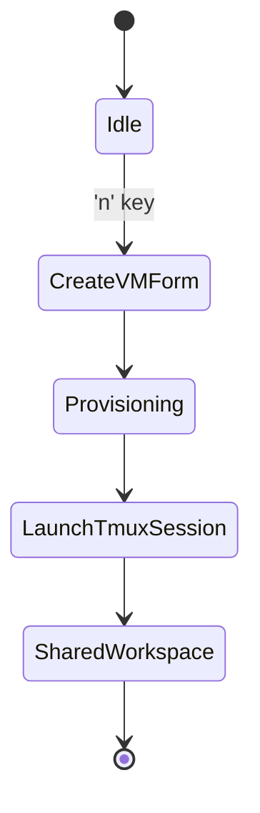
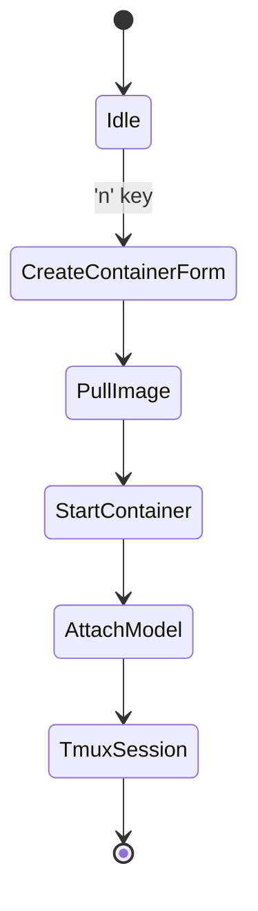
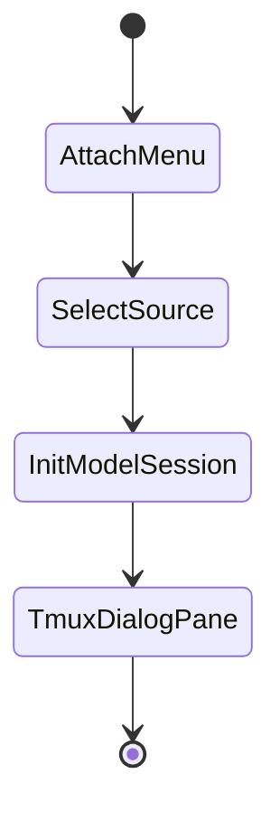

# Hydravisor – Technical Design Document

**Version:** 0.1.0

## 🎯 Purpose

This document outlines the architecture, dependencies, module interactions, and verification criteria for Hydravisor: a TUI-based virtualization and AI model management tool written in Rust.

---

## 🧱 Architecture Overview

Hydravisor is composed of:

* A Ratatui-based TUI frontend
* A backend manager orchestrating KVM and containerd
* Model adapters for Ollama (local) and Amazon Bedrock (remote)
* Integrated `tmux` session handler for shared user/AI environments

---

## 📦 Crate Decisions

| Crate                         | Purpose                          | Reason for Selection                                                    |
| ----------------------------- | -------------------------------- | ----------------------------------------------------------------------- |
| `ratatui`                     | Terminal UI rendering            | Most actively developed, expressive TUI crate in the Rust ecosystem     |
| `clap`                        | CLI parsing                      | Standard for Rust CLI apps, excellent UX and auto-docs                  |
| `serde`                       | Serialization/deserialization    | Best supported, ubiquitous in Rust; integrates with most formats        |
| `tokio`                       | Async runtime                    | Required for Bedrock, containerd, and possible WebSocket integrations   |
| `libvirt`                     | KVM backend via libvirt bindings | Proven system interface for VM management                               |
| `containerd-client`           | gRPC interface to containerd     | Direct access to container lifecycle operations                         |
| `tmux_interface`              | tmux control and interaction     | Stable Rust interface to programmatically manage tmux sessions          |
| `ollama-rs` (or CLI wrappers) | Local model management           | Preferred for embedding LLMs like LLaMA locally                         |
| `aws-sdk-bedrock`             | Bedrock model management         | Official AWS SDK, ensures long-term support and secure API interactions |

---

## 🧭 Core Workflows & State Diagrams

### 1. **Launch VM with Agent**



### 2. **Launch Container with Model**



### 3. **Attach Model to Running Session**



---

## 🧪 Functional Test Parameters

| Component           | Goal                                | Test Criteria                                              |
| ------------------- | ----------------------------------- | ---------------------------------------------------------- |
| TUI Panels          | Intuitive VM/container list view    | Cursor navigation, refresh timing, and keystroke mapping   |
| VM Launch           | Provision new KVM instance          | VM boots with correct image, config, and IP assigned       |
| Container Launch    | Start isolated container            | Pull succeeds, container starts and remains stable         |
| Ollama Integration  | Interact with local model           | Response within 1s, input/output history preserved         |
| Bedrock Integration | Connect to and chat with remote LLM | Auth flow, latency < 1.5s, zero client crash tolerance     |
| Tmux Integration    | Shared dialog+shell per instance    | Panes created, synced, and persistent post-crash           |
| Server Hooks        | Accept remote launch requests       | WebSocket endpoint test, response code & rate limit checks |

---

## 🧪 Non-Functional Requirements

| Requirement           | Goal                                        | Validation Method                           |
| --------------------- | ------------------------------------------- | ------------------------------------------- |
| Startup Time          | TUI boot time < 1s                          | Unit test with cold-start benchmark         |
| Resource Usage        | TUI idle < 30MB RSS                         | System resource monitoring under load       |
| CLI Ergonomics        | Commands self-documenting, short flags      | Validate `--help` output and error messages |
| Offline Compatibility | Ollama and local tools work without network | Simulated network-off tests                 |
| Modular Design        | Crate boundaries maintained                 | Code review & cargo module linter           |

---

## 🎥 Tmux Session Recording & Archiving

### Objective

Record terminal interaction sessions, preserving both user and model behavior. These logs can be replayed, exported, or analyzed for audit and learning purposes.

### Implementation Strategy

* Use `tmux`'s `capture-pane` and `save-buffer` commands.
* Trigger recordings automatically on instance launch or by user toggle.
* Session metadata includes:

  * Instance ID or name
  * Timestamp (start/end)
  * Associated model and user role
  * Terminal log (plaintext or JSON structured)

### Replay Options

* Use `tmux` buffer restoration
* Stream log into a playback shell view
* Export as ANSI-correct `.cast` (e.g., for Asciinema compatibility)

### Archive Format

* Directory per session:

  ```text
  ~/.hydravisor/logs/
  └── session-2025-05-29T20:15:42Z/
      ├── meta.json
      ├── terminal.log
      └── dialog.jsonl
  ```

### Functional Tests

| Scenario                          | Expectation                                   |
| --------------------------------- | --------------------------------------------- |
| VM with tmux recording enabled    | Log file exists after shutdown                |
| Mid-session user-initiated save   | Buffer saved and available via CLI export     |
| Model messages recorded correctly | Model dialog separated into structured format |

---

*Document authored by Kelsea & Alethe – 2025*

