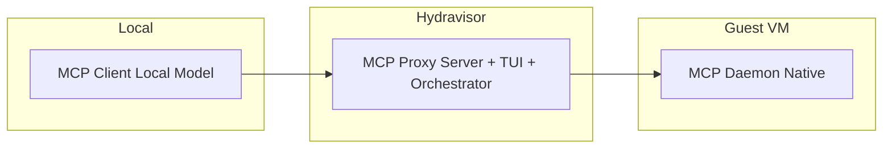
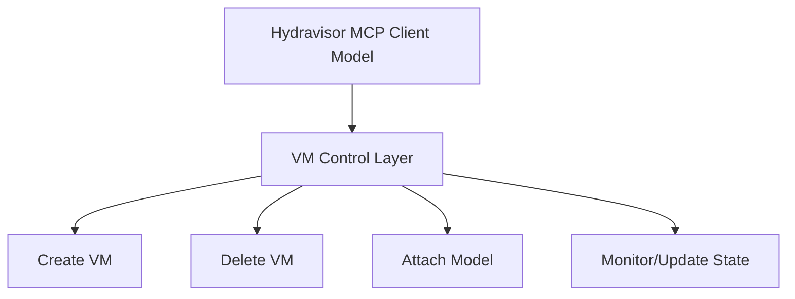
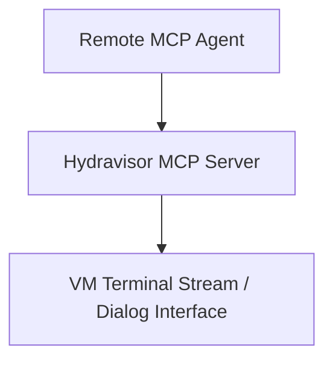
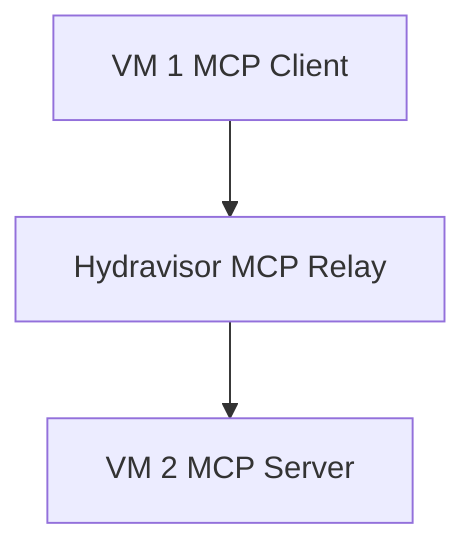
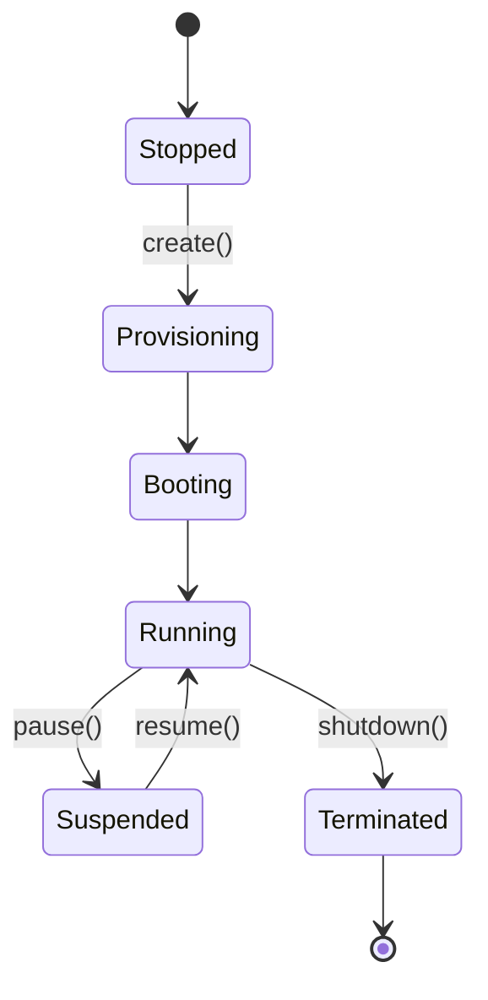
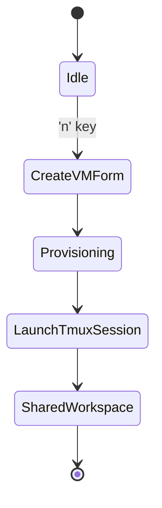
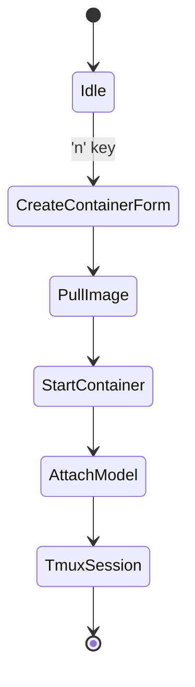
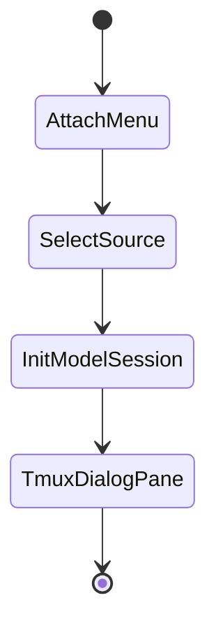

# Hydravisor – Technical Design Document

**Version:** 0.1.0

## 🎯 Purpose

This document outlines the architecture, dependencies, module interactions, and verification criteria for Hydravisor: a TUI-based virtualization and AI model management tool written in Rust.

---

## 🧱 Architecture Overview

Hydravisor is composed of:

* A Ratatui-based TUI frontend
* A backend manager orchestrating KVM and containerd
* Model adapters for Ollama (local) and Amazon Bedrock (remote)
* Integrated `tmux` session handler for shared user/AI environments
* Model Context Protocol (MCP) client/server interface for coordinating AI agents

---

## 🔒 Security & Authorization

Hydravisor is designed with AI containment, auditability, and user isolation as first-class concerns.

### Design Principles

* **Default Deny**: All remote actions require explicit ACL entries.
* **Signed Identity**: Every MCP request is signed with a model or session fingerprint.
* **Per-VM Access Control**: Agent and user access is scoped to instance ID with role granularity.
* **Session Boundaries**: tmux panes and logs are namespaced per-instance.

### Enforcement Features

* Runtime policy file: e.g., `~/.config/hydravisor/policy.toml`
* Agent classification: `trusted`, `sandboxed`, `audited`
* MCP commands gated by whitelist or signed approval
* Optional credential forwarding blocked at boundary

### Expanded Functional Tests

| Scenario                                    | Expectation                                           |
| ------------------------------------------- | ----------------------------------------------------- |
| Unauthorized model issues MCP create        | Request denied, audit log entry created               |
| Agent attempts cross-instance communication | Packet rejected, error feedback sent to source        |
| Valid token attaches to VM terminal session | tmux session established with role-limited privileges |
| Log integrity test under model control      | Checksum mismatch triggers alert or lockdown          |


### 🔐 Runtime Policy File

Hydravisor enforces its security posture through a structured runtime policy located at:

```
.$XDG_HOME/hydravisor/policy.toml
```

This file defines:

* **Agent Roles** (`trusted`, `sandboxed`, `audited`)
* **Permission Sets** (e.g., `create_vm`, `attach_terminal`)
* **Audit Logging Rules**
* **Default VM Resource Limits**
* **tmux Session Recording Behavior**

Each model or agent can be individually classified and constrained. The policy enforces a `deny_by_default` strategy and supports detailed logging for `audited` roles.

> See [`./technical_design/policy.toml`](./technical_design/policy.toml) for the complete schema and example configuration.

---

## 🔗 MCP Integration Design

Hydravisor serves as both an MCP client and MCP server to facilitate collaborative workflows between AI agents, host systems, and human operators.

### Key Workflows

#### 1. Local Model Agent ➝ Hydravisor ➝ VM with Native MCP Daemon



#### 2. Hydravisor Client ➝ VM Lifecycle Control



#### 3. External MCP Client ➝ Hydravisor Server ➝ Terminal Access



#### 4. VM ➝ Hydravisor ➝ Other VM (Peer-to-Peer Mediation)



### Message Routing

* Hydravisor listens on a configurable local socket or WebSocket for inbound MCP messages
* Outgoing connections to native MCP daemons in VMs are forwarded securely
* TUI visually reflects active agent connections and lifecycle control intents

---

## 🖥 VM Lifecycle Management

Hydravisor supports the full VM lifecycle:

### States



### User-Driven Actions

* **Create**: From UI or MCP message
* **Pause/Resume**: On-demand or auto-idle triggers
* **Terminate**: Forced or graceful shutdown
* **Snapshot**: Optional archival of current state

### MCP API Surface (Draft)

```json
{
  "type": "vm/create",
  "os": "ubuntu-22.04",
  "cpu": 4,
  "ram": "8GB",
  "model": "ollama:llama3"
}
```

---

## 🤔 Are We Just Rebuilding an Orchestration Layer (e.g., Kubernetes, Docker, etc...)

While Hydravisor includes orchestration elements, it is not attempting to replicate Kubernetes.

### Key Differences

* **Focus on Local + Human-AI Workflows**: Hydravisor is optimized for per-host use with direct tmux and TUI workflows, not cluster-wide abstraction.
* **Explicit Agent Mediation**: AI isolation, auditing, and terminal co-usage are core, not incidental.
* **No Pod/Service Mesh Model**: Hydravisor does not aim to route distributed microservices or abstract infrastructure.
* **Security Priority**: Terminal-level trust zoning and audit control are first-class, not layered-on.

Hydravisor is better understood as a **secure agentic compute sandbox**—a tool for working *with* local and semi-remote AI workflows, not replacing cloud orchestration stacks.

---

## 📦 Crate Decisions

| Crate                         | Purpose                          | Reason for Selection                                                    |
| ----------------------------- | -------------------------------- | ----------------------------------------------------------------------- |
| `ratatui`                     | Terminal UI rendering            | Most actively developed, expressive TUI crate in the Rust ecosystem     |
| `clap`                        | CLI parsing                      | Standard for Rust CLI apps, excellent UX and auto-docs                  |
| `serde`                       | Serialization/deserialization    | Best supported, ubiquitous in Rust; integrates with most formats        |
| `tokio`                       | Async runtime                    | Required for Bedrock, containerd, and possible WebSocket integrations   |
| `libvirt`                     | KVM backend via libvirt bindings | Proven system interface for VM management                               |
| `containerd-client`           | gRPC interface to containerd     | Direct access to container lifecycle operations                         |
| `tmux_interface`              | tmux control and interaction     | Stable Rust interface to programmatically manage tmux sessions          |
| `ollama-rs` (or CLI wrappers) | Local model management           | Preferred for embedding LLMs like LLaMA locally                         |
| `aws-sdk-bedrock`             | Bedrock model management         | Official AWS SDK, ensures long-term support and secure API interactions |

---

## 🧭 Core Workflows & State Diagrams

### 1. **Launch VM with Agent**



### 2. **Launch Container with Model**



### 3. **Attach Model to Running Session**



---

## 🎛️ Command vs. Interactive Mode

Hydravisor must not interfere with existing user-defined tmux or terminal keybindings.

### Design Goals

* Separate command mode from application-interactive mode
* Maintain native tmux and editor workflows
* Offer intuitive and configurable modifier key setup

### Initial Behavior: Dedicated Session Mode (MVP)

* Hydravisor runs in its own `tmux` window or session
* All keybindings are local to the Hydravisor window
* External commands must be issued from within the application pane

### Future Enhancement: Modal Mode (Optional)

* Activated via a double-prefix approach: `C-b` → `C-9` → `{hydravisor-command}`
* Avoids using `h`, which is often reserved for `help`
* Proposed rationale: 9 = one less than 10 (Hydravisor has 10 letters); also easy to reach
* Configurable in `~/.config/hydravisor/config.toml`

```toml
[interface]
mode = "session"     # Options: "session" or "modal"
modal_key = "9"
```

---

## 🧾 Decision Log

| Date       | Decision                                                         | Rationale                                                                  |
| ---------- | ---------------------------------------------------------------- | -------------------------------------------------------------------------- |
| 2025-05-29 | Use dedicated session for MVP, modal interface as future feature | Simpler input model, easier to implement and test                          |
| 2025-05-29 | Avoid use of `h` key in modal shortcut                           | Conventionally associated with `help`; conflicts with common muscle memory |
| 2025-05-29 | Adopt `C-b` → `C-9` as modal entrypoint                          | Uncommon binding, mnemonic for '9 of 10 letters', ergonomic in tmux users  |

---

## 🧪 Functional Test Parameters

| Component           | Goal                                     | Test Criteria                                              |
| ------------------- | ---------------------------------------- | ---------------------------------------------------------- |
| TUI Panels          | Intuitive VM/container list view         | Cursor navigation, refresh timing, and keystroke mapping   |
| VM Launch           | Provision new KVM instance               | VM boots with correct image, config, and IP assigned       |
| Container Launch    | Start isolated container                 | Pull succeeds, container starts and remains stable         |
| Ollama Integration  | Interact with local model                | Response within 1s, input/output history preserved         |
| Bedrock Integration | Connect to and chat with remote LLM      | Auth flow, latency < 1.5s, zero client crash tolerance     |
| Tmux Integration    | Shared dialog+shell per instance         | Panes created, synced, and persistent post-crash           |
| Server Hooks        | Accept remote launch requests            | WebSocket endpoint test, response code & rate limit checks |
| MCP Routing         | Ensure valid agent-to-VM terminal bridge | Message delivery, correct session context and permissions  |

---

## 🧪 Non-Functional Requirements

| Requirement           | Goal                                        | Validation Method                           |
| --------------------- | ------------------------------------------- | ------------------------------------------- |
| Startup Time          | TUI boot time < 1s                          | Unit test with cold-start benchmark         |
| Resource Usage        | TUI idle < 30MB RSS                         | System resource monitoring under load       |
| CLI Ergonomics        | Commands self-documenting, short flags      | Validate `--help` output and error messages |
| Offline Compatibility | Ollama and local tools work without network | Simulated network-off tests                 |
| Modular Design        | Crate boundaries maintained                 | Code review & cargo module linter           |

---

## 🎥 Tmux Session Recording & Archiving

### Objective

Record terminal interaction sessions, preserving both user and model behavior. These logs can be replayed, exported, or analyzed for audit and learning purposes.

### Implementation Strategy

* Use `tmux`'s `capture-pane` and `save-buffer` commands.
* Trigger recordings automatically on instance launch or by user toggle.
* Session metadata includes:

  * Instance ID or name
  * Timestamp (start/end)
  * Associated model and user role
  * Terminal log (plaintext or JSON structured)

### Replay Options

* Use `tmux` buffer restoration
* Stream log into a playback shell view
* Export as ANSI-correct `.cast` (e.g., for Asciinema compatibility)

### Archive Format

```text
~/.hydravisor/logs/
└── session-2025-05-29T20:15:42Z/
    ├── meta.json
    ├── terminal.log
    └── dialog.jsonl
```

### Functional Tests

| Scenario                          | Expectation                                   |
| --------------------------------- | --------------------------------------------- |
| VM with tmux recording enabled    | Log file exists after shutdown                |
| Mid-session user-initiated save   | Buffer saved and available via CLI export     |
| Model messages recorded correctly | Model dialog separated into structured format |

---

*Document authored by Kelsea & Alethe – 2025*