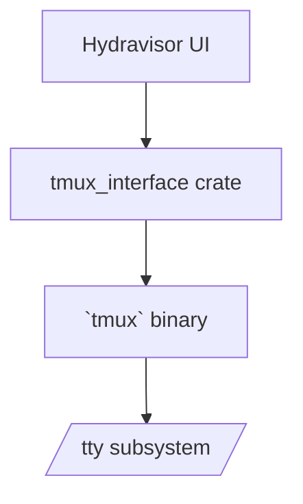
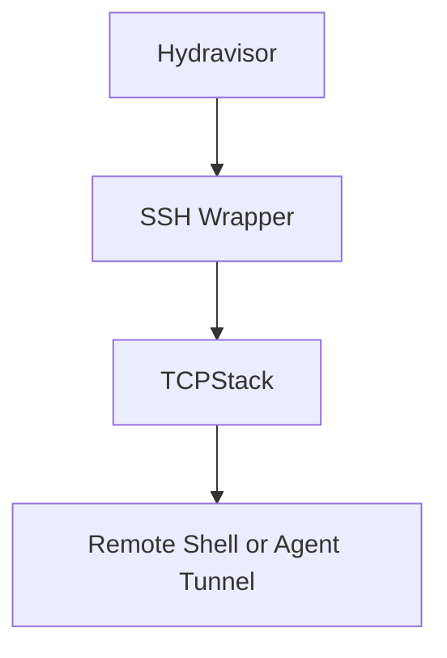
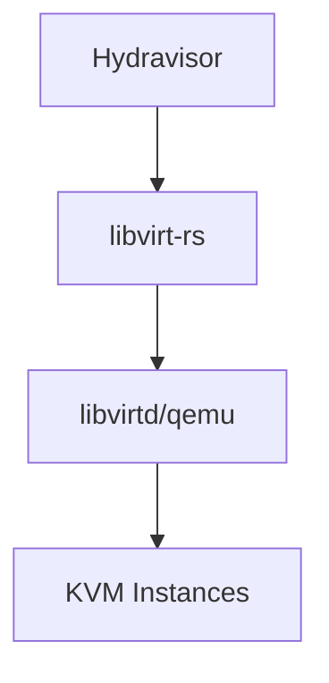
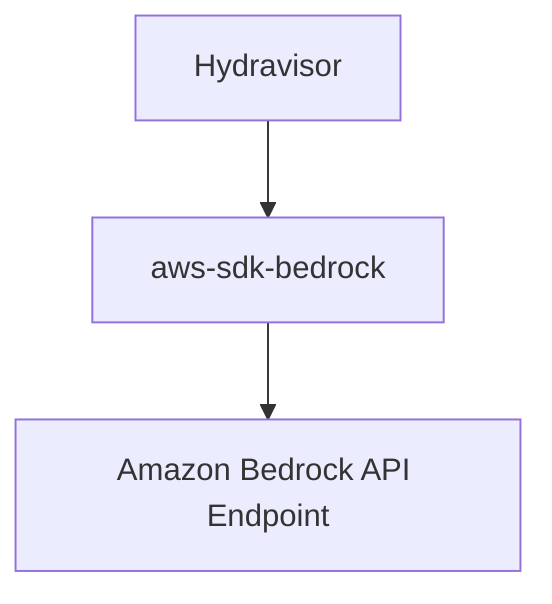

# Hydravisor – Interface Architecture Specification

**Version:** 0.1.0  
**File:** `./technical_design/interface.design.md`

---

## 🎯 Purpose
This document details the low-level integration plan between Hydravisor and key system components: TMUX, SSH, KVM (via libvirt), containerd, Ollama, and Amazon Bedrock. It includes detailed entity diagrams, API layers, and rationale for interface decisions.

---

## 📦 External Interfaces

### 1. TMUX
**Method:** External CLI via `tmux` binary + Rust wrapper crate (`tmux_interface`)  
**Use Cases:** Session creation, pane attach/detach, capture logs



---

### 2. SSH
**Method:** Native TCP via `openssh-rs` or `russh`, or subprocess-based `ssh` execution  
**Use Cases:** Remote access to VMs, tunnels for MCP agents



---

### 3. KVM
**Method:** `libvirt` via Rust bindings (`libvirt-rs`)  
**Use Cases:** Full VM lifecycle: define, create, start, shutdown, snapshot



---

### 4. containerd
**Method:** gRPC via `containerd-client` crate  
**Use Cases:** Pull image, start/stop container, inspect runtime state

```mermaid
graph TD
    Hydravisor --> ContainerAPI[containerd-client (gRPC)]
    ContainerAPI --> containerdD[containerd daemon]
    containerdD --> OCI[OCI runtime (e.g. runc)]
```

---

### 5. Ollama
**Method:** HTTP (localhost or unix socket) to Ollama API  
**Use Cases:** List models, load model, stream inference

```mermaid
graph TD
    Hydravisor --> OllamaClient[Ollama HTTP API]
    OllamaClient --> OllamaDaemon[/opt/ollama/bin/ollama]
    OllamaDaemon --> LocalModel[ggml or similar backend]
```

---

### 6. Amazon Bedrock
**Method:** AWS SDK (`aws-sdk-bedrock`) over HTTPS  
**Use Cases:** Secure remote model invocation



---

## ✅ Interface Behavior Checklist

| Interface     | Auth Model                | Resilient Reconnect | Logging Scope            | Notes                           |
|---------------|---------------------------|----------------------|---------------------------|----------------------------------|
| TMUX          | Local control              | Yes                  | Per-pane + full session   | Uses `capture-pane`             |
| SSH           | Key or password            | Optional             | STDOUT/STDERR             | Agent mode via port forward     |
| KVM/libvirt   | Socket w/ system perms     | Yes                  | Libvirt XML + event bus   | Snapshot requires full access   |
| containerd    | gRPC unix socket           | Yes                  | Event stream + errors     | May require root                |
| Ollama        | Local socket or HTTP       | Yes                  | Model/stdout via API      | Model lifecycle configurable    |
| Bedrock       | AWS IAM Signature V4       | Yes                  | Full request/response log | Managed via AWS SDK             |

---

Let me know if you'd like to proceed with implementation-layer specs or start building test stubs/mocks for these interfaces.
