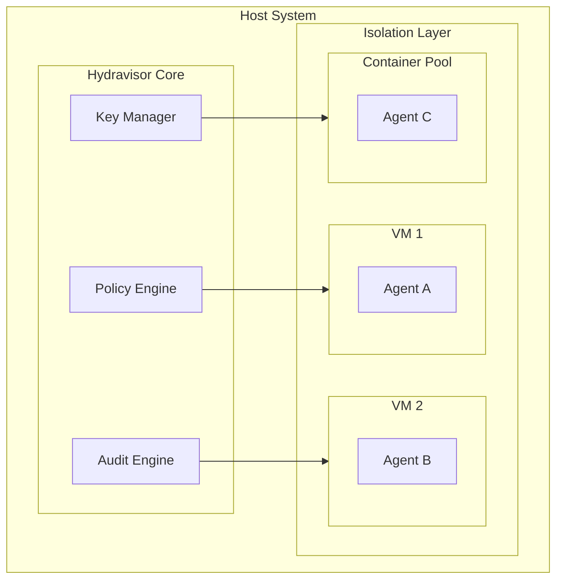

# Security Model

## Overview

Hydravisor implements a defense-in-depth security model designed specifically for AI agent sandbox environments. The security model assumes that AI agents are untrusted entities that require comprehensive monitoring, strict resource controls, and robust isolation mechanisms.

## Threat Model

### Primary Threats
1. **Malicious Agent Behavior**: Agents attempting to escape sandbox, access unauthorized resources, or cause system damage
2. **Agent Compromise**: Legitimate agents being compromised by external attackers
3. **Resource Exhaustion**: Agents consuming excessive compute, memory, or network resources
4. **Data Exfiltration**: Agents attempting to extract sensitive data from the host or other environments
5. **Privilege Escalation**: Agents attempting to gain elevated privileges within or outside their sandbox
6. **Lateral Movement**: Compromised agents attempting to access other agent environments

### Trust Assumptions
- **Hydravisor Core**: Fully trusted - runs with elevated privileges on host
- **Host Infrastructure**: Trusted - assumed to be properly secured and maintained
- **AI Agents**: Untrusted - all agent actions are potentially malicious
- **Agent Environments**: Untrusted - environments may be compromised by agents
- **Human Operators**: Partially trusted - can access administrative functions but actions are audited

## Security Architecture

### Multi-Layer Defense



### Layer 1: Hardware/Hypervisor Isolation
- **KVM Virtualization**: Full hardware-level isolation for VM-based environments
- **Container Runtime Security**: User namespaces, cgroups, and seccomp for container isolation
- **CPU/Memory Protection**: Hardware-enforced resource boundaries
- **Network Isolation**: Separate network namespaces and virtual interfaces

### Layer 2: Operating System Controls
- **User Isolation**: Dedicated user accounts per environment with minimal privileges
- **Filesystem Restrictions**: Chroot jails, bind mounts, and read-only filesystems
- **Capability Dropping**: Minimal Linux capabilities assigned to agent processes
- **Syscall Filtering**: Seccomp profiles to restrict dangerous system calls

### Layer 3: Application-Level Security
- **SSH Key Isolation**: Ephemeral keys per session with automatic rotation
- **Process Monitoring**: Real-time tracking of all process executions
- **Resource Quotas**: Strict limits on CPU, memory, disk, and network usage
- **Command Filtering**: Blocked commands and restricted shell environments

### Layer 4: Network Security
- **Network Segmentation**: Isolated networks per environment or policy group
- **Firewall Rules**: Default-deny with explicit allow rules per policy
- **Traffic Monitoring**: Deep packet inspection and connection logging
- **DNS Filtering**: Controlled DNS resolution with malicious domain blocking

### Layer 5: Audit and Monitoring
- **Comprehensive Logging**: All actions logged with tamper-proof storage
- **Real-time Alerting**: Immediate notifications for policy violations
- **Behavioral Analysis**: ML-based anomaly detection for unusual agent behavior
- **Forensic Capabilities**: Complete audit trails for incident investigation

## Policy Framework

### Policy Types

#### Resource Policies
Control computational and storage resources allocated to environments.

```yaml
resource_policy:
  name: "standard_limits"
  description: "Standard resource limits for development environments"
  limits:
    cpu_cores: 2
    cpu_percent: 80
    memory_mb: 4096
    disk_gb: 20
    network_mbps: 10
    process_count: 100
    file_handles: 1000
    session_duration_hours: 8
  
  quotas:
    daily_cpu_hours: 16
    daily_network_gb: 1
    weekly_disk_writes_gb: 10
```

#### Access Control