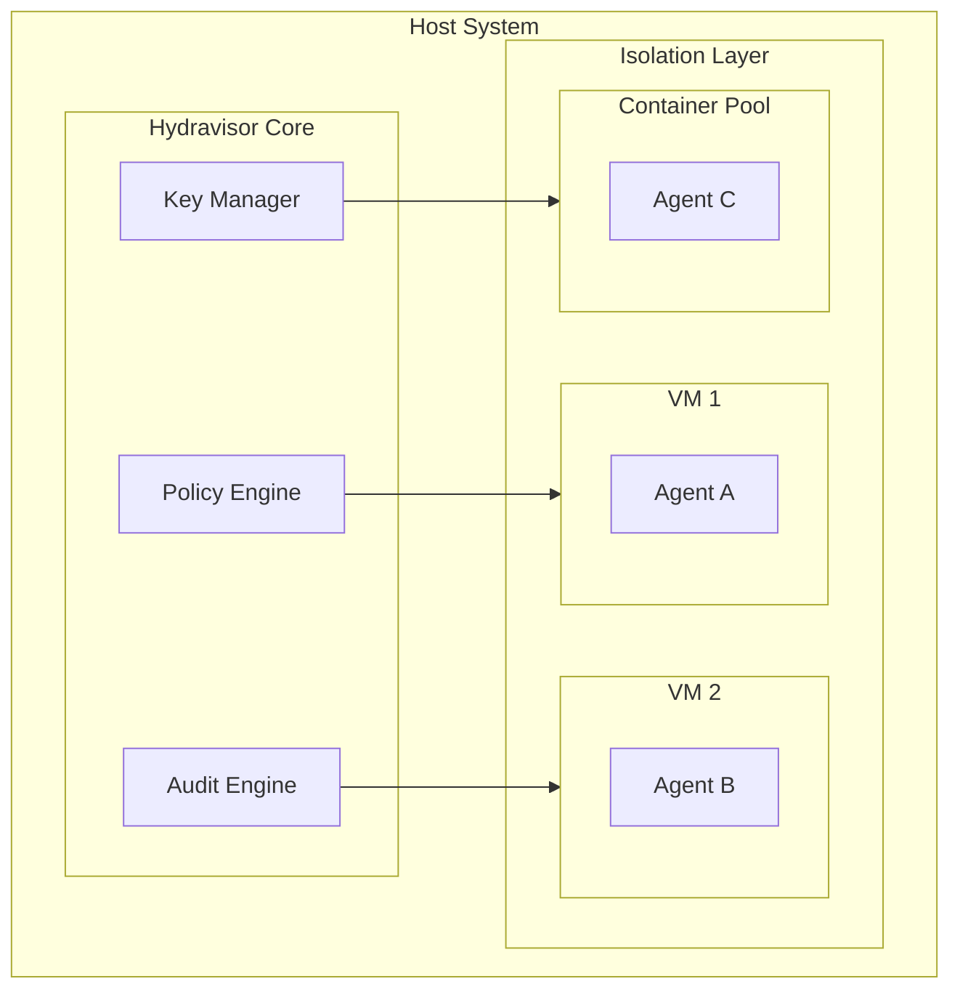

# Security Model

## Overview

Hydravisor implements a defense-in-depth security model designed specifically for AI agent sandbox environments. The security model assumes that AI agents are untrusted entities that require comprehensive monitoring, strict resource controls, and robust isolation mechanisms.

## Threat Model

### Primary Threats
1. **Malicious Agent Behavior**: Agents attempting to escape sandbox, access unauthorized resources, or cause system damage
2. **Agent Compromise**: Legitimate agents being compromised by external attackers
3. **Resource Exhaustion**: Agents consuming excessive compute, memory, or network resources
4. **Data Exfiltration**: Agents attempting to extract sensitive data from the host or other environments
5. **Privilege Escalation**: Agents attempting to gain elevated privileges within or outside their sandbox
6. **Lateral Movement**: Compromised agents attempting to access other agent environments

### Trust Assumptions
- **Hydravisor Core**: Fully trusted - runs with elevated privileges on host
- **Host Infrastructure**: Trusted - assumed to be properly secured and maintained
- **AI Agents**: Untrusted - all agent actions are potentially malicious
- **Agent Environments**: Untrusted - environments may be compromised by agents
- **Human Operators**: Partially trusted - can access administrative functions but actions are audited

## Security Architecture

### Multi-Layer Defense



### Layer 1: Hardware/Hypervisor Isolation
- **KVM Virtualization**: Full hardware-level isolation for VM-based environments
- **Container Runtime Security**: User namespaces, cgroups, and seccomp for container isolation
- **CPU/Memory Protection**: Hardware-enforced resource boundaries
- **Network Isolation**: Separate network namespaces and virtual interfaces

### Layer 2: Operating System Controls
- **User Isolation**: Dedicated user accounts per environment with minimal privileges
- **Filesystem Restrictions**: Chroot jails, bind mounts, and read-only filesystems
- **Capability Dropping**: Minimal Linux capabilities assigned to agent processes
- **Syscall Filtering**: Seccomp profiles to restrict dangerous system calls

### Layer 3: Application-Level Security
- **SSH Key Isolation**: Ephemeral keys per session with automatic rotation
- **Process Monitoring**: Real-time tracking of all process executions
- **Resource Quotas**: Strict limits on CPU, memory, disk, and network usage
- **Command Filtering**: Blocked commands and restricted shell environments

### Layer 4: Network Security
- **Network Segmentation**: Isolated networks per environment or policy group
- **Firewall Rules**: Default-deny with explicit allow rules per policy
- **Traffic Monitoring**: Deep packet inspection and connection logging
- **DNS Filtering**: Controlled DNS resolution with malicious domain blocking

### Layer 5: Audit and Monitoring
- **Comprehensive Logging**: All actions logged with tamper-proof storage
- **Real-time Alerting**: Immediate notifications for policy violations
- **Behavioral Analysis**: ML-based anomaly detection for unusual agent behavior
- **Forensic Capabilities**: Complete audit trails for incident investigation

## Policy Framework

### Policy Types

#### Resource Policies
Control computational and storage resources allocated to environments.

```yaml
resource_policy:
  name: "standard_limits"
  description: "Standard resource limits for development environments"
  limits:
    cpu_cores: 2
    cpu_percent: 80
    memory_mb: 4096
    disk_gb: 20
    network_mbps: 10
    process_count: 100
    file_handles: 1000
    session_duration_hours: 8
  
  quotas:
    daily_cpu_hours: 16
    daily_network_gb: 1
    weekly_disk_writes_gb: 10
```

#### Access Control


# Security Model

## Overview

Hydravisor implements a defense-in-depth security model designed specifically for AI agent sandbox environments. The security model assumes that AI agents are untrusted entities that require comprehensive monitoring, strict resource controls, and robust isolation mechanisms.

## Threat Model

### Primary Threats
1. **Malicious Agent Behavior**: Agents attempting to escape sandbox, access unauthorized resources, or cause system damage
2. **Agent Compromise**: Legitimate agents being compromised by external attackers
3. **Resource Exhaustion**: Agents consuming excessive compute, memory, or network resources
4. **Data Exfiltration**: Agents attempting to extract sensitive data from the host or other environments
5. **Privilege Escalation**: Agents attempting to gain elevated privileges within or outside their sandbox
6. **Lateral Movement**: Compromised agents attempting to access other agent environments

### Trust Assumptions
- **Hydravisor Core**: Fully trusted - runs with elevated privileges on host
- **Host Infrastructure**: Trusted - assumed to be properly secured and maintained
- **AI Agents**: Untrusted - all agent actions are potentially malicious
- **Agent Environments**: Untrusted - environments may be compromised by agents
- **Human Operators**: Partially trusted - can access administrative functions but actions are audited

## Security Architecture

### Multi-Layer Defense

```
┌─────────────────────────────────────────────────────────────────┐
│                          Host System                            │
│  ┌─────────────────────────────────────────────────────────┐    │
│  │                   Hydravisor Core                       │    │
│  │  ┌─────────────┐  ┌─────────────┐  ┌─────────────┐     │    │
│  │  │   Policy    │  │    Audit    │  │     Key     │     │    │
│  │  │   Engine    │  │   Engine    │  │  Manager    │     │    │
│  │  └─────────────┘  └─────────────┘  └─────────────┘     │    │
│  └─────────────────────────────────────────────────────────┘    │
│           │                      │                      │        │
│  ┌────────┼──────────────────────┼──────────────────────┼───┐    │
│  │        ▼                      ▼                      ▼   │    │
│  │  ┌──────────┐        ┌──────────┐        ┌──────────┐   │    │
│  │  │   VM 1   │        │   VM 2   │        │ Container│   │    │
│  │  │          │        │          │        │    Pool   │   │    │
│  │  │ Agent A  │        │ Agent B  │        │ Agent C  │   │    │
│  │  │          │        │          │        │          │   │    │
│  │  └──────────┘        └──────────┘        └──────────┘   │    │
│  │                    Isolation Layer                      │    │
│  └─────────────────────────────────────────────────────────┘    │
└─────────────────────────────────────────────────────────────────┘
```

### Layer 1: Hardware/Hypervisor Isolation
- **KVM Virtualization**: Full hardware-level isolation for VM-based environments
- **Container Runtime Security**: User namespaces, cgroups, and seccomp for container isolation
- **CPU/Memory Protection**: Hardware-enforced resource boundaries
- **Network Isolation**: Separate network namespaces and virtual interfaces

### Layer 2: Operating System Controls
- **User Isolation**: Dedicated user accounts per environment with minimal privileges
- **Filesystem Restrictions**: Chroot jails, bind mounts, and read-only filesystems
- **Capability Dropping**: Minimal Linux capabilities assigned to agent processes
- **Syscall Filtering**: Seccomp profiles to restrict dangerous system calls

### Layer 3: Application-Level Security
- **SSH Key Isolation**: Ephemeral keys per session with automatic rotation
- **Process Monitoring**: Real-time tracking of all process executions
- **Resource Quotas**: Strict limits on CPU, memory, disk, and network usage
- **Command Filtering**: Blocked commands and restricted shell environments

### Layer 4: Network Security
- **Network Segmentation**: Isolated networks per environment or policy group
- **Firewall Rules**: Default-deny with explicit allow rules per policy
- **Traffic Monitoring**: Deep packet inspection and connection logging
- **DNS Filtering**: Controlled DNS resolution with malicious domain blocking

### Layer 5: Audit and Monitoring
- **Comprehensive Logging**: All actions logged with tamper-proof storage
- **Real-time Alerting**: Immediate notifications for policy violations
- **Behavioral Analysis**: ML-based anomaly detection for unusual agent behavior
- **Forensic Capabilities**: Complete audit trails for incident investigation

## Policy Framework

### Policy Types

#### Resource Policies
Control computational and storage resources allocated to environments.

```yaml
resource_policy:
  name: "standard_limits"
  description: "Standard resource limits for development environments"
  limits:
    cpu_cores: 2
    cpu_percent: 80
    memory_mb: 4096
    disk_gb: 20
    network_mbps: 10
    process_count: 100
    file_handles: 1000
    session_duration_hours: 8
  
  quotas:
    daily_cpu_hours: 16
    daily_network_gb: 1
    weekly_disk_writes_gb: 10
```

#### Access Control Policies
Define what resources and actions agents can access within their environments.

```yaml
access_policy:
  name: "restricted_research"
  description: "Locked-down environment for untrusted research agents"
  
  filesystem:
    writable_paths:
      - "/workspace"
      - "/tmp"
      - "/home/agent/.cache"
    readonly_paths:
      - "/usr"
      - "/bin"
      - "/lib"
    blocked_paths:
      - "/proc/*/mem"
      - "/sys/kernel"
      - "/dev/kmem"
    
  network:
    allow_internet: false
    allowed_domains:
      - "pypi.org"
      - "github.com"
    blocked_ports:
      - "22"  # SSH
      - "3389"  # RDP
    max_connections: 10
    
  processes:
    allowed_commands:
      - "/usr/bin/python3"
      - "/usr/bin/git"
      - "/usr/bin/pip"
    blocked_commands:
      - "/bin/bash"
      - "/usr/bin/curl"
      - "/usr/bin/wget"
      - "/usr/bin/nc"
    allow_shell: false
    max_processes: 50
    
  privileges:
    allow_sudo: false
    allow_setuid: false
    capabilities: []  # No special capabilities
```

#### Behavioral Policies
Monitor and restrict agent behavior patterns and activities.

```yaml
behavioral_policy:
  name: "anomaly_detection"
  description: "Detect and respond to suspicious agent behavior"
  
  monitoring:
    file_access_rate:
      max_per_minute: 1000
      alert_threshold: 800
    
    network_activity:
      max_requests_per_minute: 100
      max_data_transfer_mb: 100
      
    process_spawning:
      max_new_processes_per_minute: 20
      monitor_process_tree: true
      
    system_calls:
      monitor_dangerous_syscalls: true
      blocked_syscalls:
        - "ptrace"
        - "mount" 
        - "reboot"
        
  responses:
    on_violation:
      - action: "alert"
        severity: "medium"
      - action: "throttle"
        duration_seconds: 60
      - action: "log_detailed"
        
    on_repeated_violation:
      - action: "suspend_session"
        threshold: 3
      - action: "alert"
        severity: "high"
```

#### Audit Policies
Configure what activities are logged and how audit data is managed.

```yaml
audit_policy:
  name: "comprehensive_logging"
  description: "Detailed logging for compliance and security"
  
  events:
    file_operations:
      log_reads: false
      log_writes: true
      log_deletes: true
      log_permissions: true
      
    command_execution:
      log_all: true
      capture_output: true
      capture_environment: true
      
    network_activity:
      log_connections: true
      log_dns_queries: true
      capture_packet_headers: false
      
    authentication:
      log_ssh_sessions: true
      log_key_usage: true
      log_failed_attempts: true
      
  retention:
    default_retention_days: 90
    high_risk_retention_days: 365
    compress_after_days: 30
    
  export:
    formats: ["json", "csv", "syslog"]
    real_time_streaming: true
    batch_export_interval_hours: 24
```

### Policy Composition and Inheritance

Policies can be combined and inherited to create complex security profiles:

```yaml
policy_template:
  name: "ai_research_standard"
  description: "Standard security profile for AI research environments"
  
  inherits:
    - "base_security"
    - "research_access"
    
  overrides:
    resource_policy:
      limits:
        memory_mb: 8192  # Override base limit
        
  additional_policies:
    - name: "gpu_access"
      type: "resource"
      rules:
        gpu_memory_mb: 4096
        gpu_compute_percent: 50
```

## Authentication and Authorization

### Agent Authentication
- **MCP Token-Based Auth**: Agents authenticate using Bearer tokens with configurable expiration
- **SSH Key Authentication**: Ephemeral SSH keys generated per session
- **Mutual TLS**: Optional client certificate authentication for high-security environments
- **API Rate Limiting**: Configurable rate limits per agent or token

### Human Authentication
- **Local User Accounts**: Integration with system users and groups
- **External Identity Providers**: LDAP, Active Directory, OAuth2/OIDC support
- **Multi-Factor Authentication**: TOTP, hardware tokens, biometric authentication
- **Role-Based Access Control**: Configurable roles with granular permissions

### Authorization Model

```rust
// Role definitions
pub enum Role {
    Administrator,     // Full system access
    Operator,         // Environment management, limited policy changes
    Auditor,          // Read-only access to logs and reports
    Developer,        // Create/manage own environments
    Observer,         // View-only access to dashboards
}

// Permission granularity
pub enum Permission {
    // Environment management
    CreateEnvironment(EnvironmentType),
    DestroyEnvironment(SessionId),
    AttachToEnvironment(SessionId),
    
    // Policy management  
    CreatePolicy(PolicyType),
    ModifyPolicy(PolicyId),
    AssignPolicy(SessionId, PolicyId),
    
    // Audit access
    ViewAuditLogs(SessionId),
    ExportAuditData(DateRange),
    
    // System administration
    ModifySystemConfig,
    ManageUsers,
    ViewSystemMetrics,
}
```

## Key Management

### SSH Key Lifecycle

```
┌─────────────────┐    ┌─────────────────┐    ┌─────────────────┐
│  Agent Request  │───▶│   Key Generate  │───▶│  Key Distribute │
│                 │    │                 │    │                 │
└─────────────────┘    └─────────────────┘    └─────────────────┘
         │                       │                       │
         │              ┌─────────────────┐              │
         │              │  Key Rotation   │              │
         │              │   (Periodic)    │              │
         │              └─────────────────┘              │
         │                       │                       │
         ▼              ┌─────────────────┐              ▼
┌─────────────────┐    │  Key Revocation │    ┌─────────────────┐
│ Session Cleanup │◀───│  (On Violation) │    │ Environment SSH │
│                 │    │                 │    │     Daemon      │
└─────────────────┘    └─────────────────┘    └─────────────────┘
```

### Key Security Features
- **Ephemeral Keys**: New key pair generated for each session
- **Automatic Rotation**: Keys rotated on configurable schedule (default: 24 hours)
- **Immediate Revocation**: Keys can be instantly revoked on policy violations
- **Audit Trail**: All key operations logged with session correlation
- **Secure Storage**: Private keys encrypted at rest using host key management

### Key Distribution Protocol

```rust
#[derive(Serialize, Deserialize)]
pub struct KeyRequest {
    pub session_id: SessionId,
    pub agent_id: AgentId,
    pub requested_access: AccessLevel,
    pub duration_hours: Option<u32>,
}

#[derive(Serialize, Deserialize)]
pub struct KeyResponse {
    pub ssh_private_key: String,
    pub ssh_endpoint: SocketAddr,
    pub username: String,
    pub expires_at: DateTime<Utc>,
    pub restrictions: Vec<SSHRestriction>,
}

pub enum SSHRestriction {
    CommandPattern(String),        // Only allow matching commands
    SourceIP(IpAddr),             // Restrict source IP
    PortForwarding(bool),         // Allow/deny port forwarding
    AgentForwarding(bool),        // Allow/deny SSH agent forwarding
    TTL(Duration),                // Maximum session duration
}
```

## Audit and Monitoring

### Audit Event Categories

#### System Events
- Environment creation, modification, destruction
- Policy changes and assignments
- User authentication and authorization
- System configuration changes

#### Agent Activity Events  
- SSH session establishment and termination
- Command executions with full command line and output
- File system operations (create, modify, delete, move)
- Network connections and data transfers
- Process creation and termination

#### Security Events
- Policy violations and enforcement actions
- Authentication failures and suspicious access patterns
- Resource limit violations
- Anomalous behavior detection alerts
- Key generation, rotation, and revocation

### Real-Time Monitoring

```yaml
monitoring_config:
  real_time_alerts:
    - name: "policy_violation"
      condition: "event.type == 'PolicyViolation'"
      severity: "high"
      actions:
        - "notify_admin"
        - "pause_session"
        
    - name: "resource_exhaustion"
      condition: "event.cpu_percent > 95 OR event.memory_percent > 95"
      severity: "medium"
      actions:
        - "throttle_resources"
        - "alert_operator"
        
    - name: "privilege_escalation_attempt"
      condition: "event.type == 'CommandExecute' AND event.command CONTAINS 'sudo'"
      severity: "critical"
      actions:
        - "terminate_session"
        - "alert_security_team"
        
  dashboards:
    - name: "security_overview"
      refresh_seconds: 5
      panels:
        - "active_threats"
        - "policy_violations_24h"
        - "resource_utilization"
        - "agent_activity_heatmap"
```

### Forensic Capabilities

#### Session Reconstruction
- Complete tmux session recordings with playback capability
- Command history with timestamps and exit codes
- File system state snapshots at configurable intervals
- Network packet captures for suspicious activities

#### Incident Response
- Automatic environment isolation on security events
- Evidence collection and preservation
- Chain of custody tracking for audit data
- Integration with external SIEM systems

## Compliance and Standards

### Framework Alignment
- **NIST Cybersecurity Framework**: Risk management and security controls
- **ISO 27001**: Information security management systems
- **SOC 2 Type II**: Security, availability, and confidentiality controls
- **GDPR**: Data protection and privacy requirements

### Audit Requirements
- **Immutable Logging**: Tamper-evident audit trails using cryptographic hashing
- **Data Retention**: Configurable retention periods with automated cleanup
- **Access Controls**: Role-based access to audit data with approval workflows
- **Export Capabilities**: Multiple formats for compliance reporting

### Compliance Reporting

```rust
pub struct ComplianceReport {
    pub report_id: String,
    pub report_type: ComplianceStandard,
    pub period: DateRange,
    pub generated_at: DateTime<Utc>,
    pub summary: ComplianceSummary,
    pub findings: Vec<ComplianceFinding>,
    pub evidence: Vec<EvidenceReference>,
}

pub enum ComplianceStandard {
    SOC2,
    ISO27001,
    NIST,
    GDPR,
    Custom(String),
}

pub struct ComplianceFinding {
    pub control_id: String,
    pub status: ComplianceStatus,
    pub description: String,
    pub evidence_count: u32,
    pub risk_level: RiskLevel,
    pub remediation_required: bool,
}
```

## Incident Response

### Automated Response Actions
- **Session Termination**: Immediate shutdown of compromised environments
- **Network Isolation**: Quarantine suspicious environments
- **Resource Throttling**: Limit resources for misbehaving agents
- **Alert Escalation**: Automated notification chains based on severity
- **Evidence Preservation**: Automatic snapshot and log collection

### Manual Response Procedures
1. **Threat Assessment**: Evaluate scope and severity of security event
2. **Containment**: Isolate affected environments and limit damage
3. **Evidence Collection**: Preserve logs, snapshots, and forensic data
4. **Analysis**: Investigate root cause and attack vectors
5. **Recovery**: Restore normal operations with security improvements
6. **Lessons Learned**: Update policies and procedures based on findings

This security model provides comprehensive protection for AI agent sandbox environments while maintaining the flexibility needed for diverse research and development use cases.