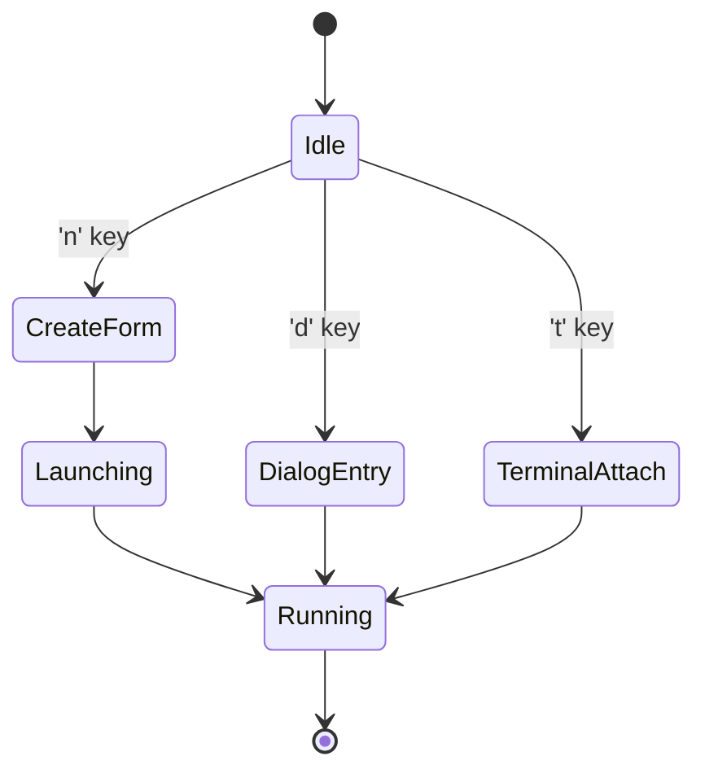

# Hydravisor – TUI Design Document

**Version:** 0.1.2  
**File:** `./technical_design/tui.design.md`

---

## 🌟 Purpose

This document outlines the visual and interactive behavior of the Hydravisor terminal interface, built using the `ratatui` crate. It defines UI structure, navigation patterns, state management, modal logic, and keybinding philosophy for both session and modal modes. It is current as of the 2025-05-29 checkpoint.

---

## ☑️ Layout Overview

### Root Application Panes
```text
+--------------------------------------------------------------+
| [Status Bar: Mode | Connected Model | Clock | Notifications] |
+---------------------+----------------------------------------+
| [VM/Container List] | [Detail View Panel]                    |
|                     |                                        |
+---------------------+----------------------------------------+
| [Dialog Interface (Chat with Model)]                         |
+--------------------------------------------------------------+
```

### Pane Descriptions
- **Status Bar:** Persistent header showing current mode, connected model, clock, and notifications.
- **VM/Container List:** Navigable list of running and available instances, showing active sessions, VM names, health, and attachability.
- **Detail View Panel:** Flip-through sub-pane (controlled by Tab/Shift-Tab or dedicated key) that cycles through:
  - Info Summary
  - Logs
  - MCP Connections
  - Agent Status
  - Network (planned)
  - MCP Connection Details
  - Running Agents
  - Agent Details / Logs
  - Local Ollama Models
- **Dialog Interface:** Dedicated pane for current model interaction (chat/message-based), showing message prompt and history with current attached model.

Note: The entire UI exists in the native application window. Modal overlays are excluded from this scope and will be considered in future revisions.

---

## 🔁 TUI Enhancements

### 🔍 View Expansion
- **MCP Connections View**: Adds a new tabbed pane to display active Model Context Protocol sessions.
- **Running Agents Panel**: Displays all active model agents and their assigned VMs or containers.
- **Local Ollama Models Panel**: Lists available local LLMs and their readiness state.

### 🔄 Pane Switching Logic
- Main right-side detail pane is swappable:
  - **VM/container list context**: cycles through Info, Logs, MCP connections, Network.
  - **MCP connection list**: switches between Connection Details, Logs.
  - **Agent list**: switches between Agent Details, Logs.

### 🌐 Modal Overlay Mode
- Reserved for future development.
- Non-intrusive pop-up summary, alert, or command overlays.
- Will not support deep interaction.

---

## 🔀 Application State Diagram



---

## ⌨️ Input & Navigation

### Navigation Keys (Session Mode)
- `Tab`: Cycle forward through detail view sub-panes / Cycle focus across panes
- `Shift-Tab`: Cycle backward through sub-panes
- `↑/↓`: Scroll list views or text
- `Enter`: Select focused item
- `h/j/k/l`: Navigate within current pane
- `Shift+h`: Previous detail sub-pane
- `Shift+l`: Next detail sub-pane

### Action Keys
- `n`: New VM/container form
- `t`: Attach terminal to instance
- `a`: Open dialog with model ("attach model")
- `q`: Close current pane or dialog
- `d`: Detach model or close session
- `Ctrl+c`: Quit

### Modal Control Overlay (planned)
- `Ctrl+b` activates a mode switch overlay.
- `Ctrl+b` → `Ctrl+9` enters **Command Mode**.
  - Enables TUI CLI for executing commands.
- `Ctrl+b` → `Ctrl+0` enters **Diagnostic Mode** (future).

> The user always overrides the model in modal priority. All UI interaction conflicts resolve in favor of the human operator.

---

## 🔑 Modal Mode Support

When configured for modal behavior (`mode = "modal"`), Hydravisor reacts only to a special tmux keychain:

### Example Chain:
- `C-b` → `C-9` → `n`: Trigger VM create form
- `C-b` → `C-9` → `a`: Attach model dialog

This avoids interfering with default tmux or vim bindings.

---

## ⚙️ Async Event Flow

Hydravisor uses a central async runtime (`tokio`) to handle non-blocking tasks:

- VM/container lifecycle operations
- Model inference interactions (Ollama/Bedrock)
- MCP socket I/O
- Logging and audit writes

### Message Queue
All user actions are enqueued as events:
```rust
enum UiEvent {
  KeyPress(Key),
  CreateVM(FormData),
  AttachTerminal(String),
  AttachDialog(String, Model),
  FlipDetailView,
  Tick,
}
```
Event dispatcher routes messages to subsystem handlers.

### Input Queue & Event Handling
- Async event queue for all input (model & user)
- Debounced redraw and scoped pane invalidation
- TUI input is **immediate-mode**, driven by ratatui's render cycle
- External model events (e.g., MCP messages) are pushed into event queue with priority flags

---

## 📊 Status Bar

Located at the top of the interface:

```
[ Mode | Connected Model | Time | Notifications ]
```

- **Mode**: Normal, Command, Modal
- **Model**: Currently attached MCP model (if any)
- **Time**: UTC or user-local
- **Notifications**: Recent errors or pending actions (log-backed, future)

---

## 🧯 Failure & Resilience Behavior

### Focus Loss
- No-op; input ignored until focus returns

### Terminal Disconnect
- Treated as a termination event unless `--headless` is set
- Cleanup performed on exit

### Application Panic
- Captures panic hook to log event
- Ensures cleanup of open logs, session state, and config paths
- All exit paths must be clean unless underlying system failure

### Terminal Resize
- Non-blocking redraw
- Treated as cosmetic; no functional impact for MVP

---

## 🛠 Config Flags (Runtime)

| Flag         | Description                              |
| ------------ | ---------------------------------------- |
| `--headless` | Prevent panic-on-disconnect; remote safe |
| `--no-ui`    | Disable TUI layer entirely               |

---

## 🧪 Functional UX Tests

| Feature               | Test                                       |
|----------------------|--------------------------------------------|
| Pane navigation       | All views switchable with `Tab`            |
| Detail pane cycling   | Sub-views rotate predictably               |
| Modal keychain        | Commands fire only after full sequence     |
| Async dialog attach   | Model output shown within 1s               |
| Error fallback        | Missing instance shows toast error panel   |
| Resize-aware layout   | No overflow or clipping at 80x24 or above  |

---

## ✏️ Future Extensions

| Feature                       | Status      | Notes                                |
| ----------------------------- | ----------- | ------------------------------------ |
| Modal overlay hotkey system   | In Design   | Shifted VIM-style or Emacs-style TBD |
| Network topology view         | Deferred    | Custom Ratatui widget                |
| In-TUI notifications          | Deferred    | Use tracing crate + ring buffer      |
| Agent role switcher overlay   | Deferred    | Must map to policy model             |
| Policy live reload            | Not Planned | Restart required for config change   |
| Accessibility / Mouse support | Future Work | Out of scope for MVP                 |

---

## 🛡️ Security/UX Guarantees

* No model can override human input focus.
* Modal transitions are logged and audit-traceable.
* Session control keys never double-bind.
* Model-to-pane redraws are filtered via event scope.

---

## 👀 Current Focus Areas (for Dev)

* [x] Define baseline pane layout
* [x] Set modal interaction defaults
* [x] Choose VIM-style keybinding model
* [ ] Implement event queue and control loop
* [ ] Support hot-swapping between detail subpanes
* [ ] Define extensible notification protocol

---

*Document authored by Kelsea & Alethe – 2025*